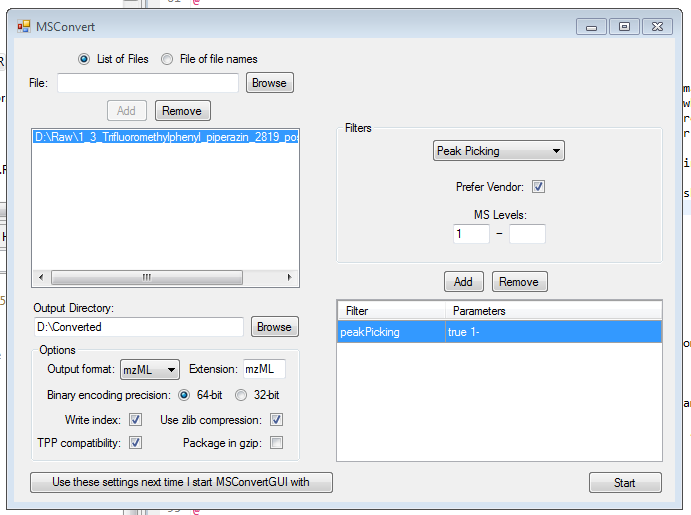

```{r echo=FALSE}
options(width=74)
```
# Introduction

*RMassBank* is a two-part computational mass spectrometry workflow:

*  In the first step, MSMS spectra of compounds are extracted from raw LC-MS data files, 
      the MSMS spectra are recalibrated using assigned fragment formulas, and effectively 
      denoised by using only annotated peaks (plus peaks which can be manually added.)
*  In the second step, the processed, recalibrated, cleaned data is prepared for 
      submission to a MassBank database. Compounds are first automatically annotated using 
      information from the Chemical Translation Service (CTS). After manually checking and 
      fixing the annotations, the information is compiled together with the spectral data
      into MassBank records, which can then be uploaded to a MassBank database.

This vignette describes basic usage with the standard workflow. The package is
flexible and allows for different advanced use cases. Examples of specialized
applications of *RMassBank* are available at the *RMassBank*
message board hosted by the Metabolomics-Forum:
(http://www.metabolomics-forum.com/viewforum.php?f=29).

# Installation and loading

The library is available from Bioconductor ((http://www.bioconductor.org)).
In addition to the library itself, it is recommended to install the OpenBabel
chemical toolkit, available from (http://www.openbabel.org) for various
platforms (or via Linux package distribution systems).

The library is loaded as follows

```{r }
library(RMassBank)
``` 

The data used in the following example is available as a package *RMassBankData*,
which must be installed separately and is loaded using 

```{r }
library(RMassBankData)
``` 

# Input files

## LC/MS data

*RMassBank* handles high-resolution LC/MS spectra in mzML format in
centroid^[The term "centroid" here refers to any kind of data which are not in profile mode, i.e. don't have continuous m/z data. It does not refer to the (mathematical) centroid peak, i.e. the area-weighted mass peak.] or in
profile mode.

Data in the examples was acquired using an LTQ Orbitrap XL instrument in profile
mode, and converted from profile-mode RAW into centroid-mode mzML
using MSConvertGUI from ProteoWizard. The settings were as shown in the 
screenshot below (note the "Peak Picking" filter.)


*Fig. 1: ProteoWiz settings for conversion to mzML*

In the standard workflow, the file names are used to identify a
compound: file names must be in the format `xxxxxxxx_1234_xxx.mzXML`,
where the xxx parts denote anything and the 1234 part denotes the compound ID in
the compound list (see below). Advanced and alternative uses can be implemented;
consult the implementation of `msms_workflow`  and `findMsMsHR` for
more information.

## Compound list

A compound list in CSV format is required to identify all compounds unambiguously. 
The CSV file is required to have at least the following columns, which are used for 
further processing and must be named correctly (but present in any order): `ID, Name, SMILES, RT,
CAS`. The columns `ID` and `SMILES` must be filled, the other columns
must be present in the file but do not need to be filled.
`ID` specifies an (arbitrary) numeric ID code which must be < 4 digits long; `SMILES` specifies
a SMILES code with the chemical structure of the compound (and is used to extract the
molecular formula, for calculation of molecular masses, for database searching in CTS etc.) 
Although the columns `Name, RT, CAS` have to be present, the
information in the columns is only used if the cells are filled.
RT, if present, specifies the retention time (in minutes; $\pm$ a window specified in the RMassBank options, see below)
where a LC/MS file is searched for the compound spectra. `CAS` and `Name`
are used as additional information while retrieving annotations from CTS. The
compound list doesn't have to be ordered in any particular way. It can contain large numbers of compounds,
even compounds which will not be actively used by the script (Note: Unused compounds
don't require a SMILES code, since they will not be accessed.)

An example list is provided with the *RMassBankData* package, and can be copied into a local folder, viewed and edited:

```{r eval=TRUE}
file.copy(system.file("list/NarcoticsDataset.csv", 
	package="RMassBankData"), "./Compoundlist.csv")
```

## Settings

A number of different settings influence RMassBank. They are partly parameters for data processing and partly constants used for annotation.

A settings template file, to be edited by hand, can be generated using

```{r eval=TRUE}
RmbSettingsTemplate("mysettings.ini")
```

where `mysettings.ini` is the file that will be generated. This file
should then be edited. Important settings are:

*  `deprofile`: Whether to use a deprofiling algorithm to work
    with profile-mode data. Default is `NA` for use with centroid-mode
    data. Allowed settings for profile-mode data include `deprofile.fwhm` (full-width half-maximum
    algorithm), `deprofile.spline` (cubic spline algorithm),
    `deprofile.localmax` (local maximum). See the respective help pages for
    detailed information.
*  `rtMargin`: The deviation allowed for retention times (in minutes) when
	extracting spectra from raw data files.
*  `rtShift`: The systematic retention time shift (in minutes) in
    the LC-MS data compared to the values in the compound list.
*  `babeldir`: The directory pointing to the OpenBabel binaries.
*  `use_version`: which MassBank data format to use. The default is the newer version 2; alternatively, the (deprecated) version 1 can be specified for MassBank servers running old versions of the server software.
*  `use_rean_peaks`: Whether or not peaks from reanalysis should be used (see below for details.)
*  `add_annotation`: Whether or not fragments should be annotated
	with the (tentative) molecular formula in MassBank records.
*  `annotations`: A list of annotation data used in the MassBank records.
	+  `authors`, `copyright`, `publication`, `license`, `instrument`, `instrument_type`, `compound_class`: values for the corresponding MassBank fields
	+  `confidence_comment`: A commentary field about "compound confidence" which is added like "COMMENT: CONFIDENCE standard compound" in the MassBank record.
	+  `internal_id_fieldname`: The name for an internal ID field in the MassBank record where to store the compound ID (in the compound list). For `internal_id_fieldname` = "MY\_ID", the ID will be stored like "COMMENT: MY\_ID 1234".
	+  `entry_prefix`: The (2-letter) prefix for MassBank accession IDs.
	+  `ms_type`, `ionization`, `lc_*`: Annotations for the LC and MS information fields in the MassBank records.
	+  `ms_dataprocessing`: Tags added to describe the data
		processing.
		In addition to the tags specified here, MS\$DATA\_PROCESSING:
		WHOLE RMassBank will be added (corresponding to a list("WHOLE" = "RMassBank") entry for this option.)
*  `annotator`: For advanced users: option to select your own custom annotator. Check ?annotator.default and the source code for details.
*  `spectraList`: The list of data-dependent scans triggered by a MS1 scan in their order; used for annotation of MassBank records. See the template file for description.
*  `accessionNumberShifts`: A list defining the starting points
    for generating MassBank record accession numbers. RMassBank generates
    2-letter + 6-digit accession numbers. The 2-letter code is defined by
    `annotations$entry_prefix`, the first 4 digits are given by the
    compound ID. The last 2 digits are generated from the position of the
    spectrum in `spectraList` and the shift given in this option for the
    selected ion type. (Example: the compound with ID 2112, processed in "pNa" mode ([M+Na]+), will have accession numbers XX211233, XX211234 ... etc in for the first, second... spectrum in the data-dependent scan, if the "pNa" shift is set to 32. )
*  `accessionBuilderFile`: A file with a user-defined function to generate accession IDs. If this is given, `accessionNumberShifts` is ignored. The function definition must be in the form `accessionBuilder <- function(cpd, spectrm, subscan)`.
  Note: This functionality is quite advanced. If you really want to specify your own `accessionBuilder` instead of using the default one, we highly encourage you to familiarize yourself with the source code of the function `.buildRecord.RmbSpectraSet` in `buildRecord.R`.
*  `electronicNoise`, `electronicNoiseWidth`: known m/z values of constant electronic noise in the spectral data; and a window (in m/z units) for exclusion of such peaks from reanalysis. Note that peaks matched in the first analysis step (see below) are not affected by this (in our tests, only a very small number of peaks was affected by this.)
*  `recalibrateBy`: Which parameter to use for recalibration:
    `dppm` (recalibrate the deviation in ppm) or `dmz`
    (recalibrate the m/z deviation).
*  `recalibrateMS1`: Whether to recalibrate MS1 data points
    separately from MS2 data points (`"separate"`), with the same
    recalibration curve as the MS2 data points (`"common"`) or not at all
    (`"none"`). Note that the MS1 datapoints points will be used to
    generate the MS2 recalibration curve in all cases (since this makes the
    recalibration curve in high-m/z regions better-defined) but may be
    recalibrated independently themselves, if desired.
*  `recalibrator`: Sets the functions to use for recalibration.
    Defaults to `list(MS1="recalibrate.loess", MS2="recalibrate.loess")`
    which uses a Loess non-parametric fit to generate a recalibration curve. Any
    custom function may be specified. The function is expected to accept a
    dataset with variables `recalfield` and `mzFound` and to return an
    object which can be used with `predict()`. The input `recalfield`
    is the value to be estimated by recalibration - it will either contain delta
    ppm values or absolute mass deviations, depending on the setting for
    `recalibrateBy`. In addition to `recalibrate.loess`,
    `recalibrate.MS1` is predefined, which uses a GAM model for
    recalibration and appears to work well for pure MS1 datapoints. However,
    common recalibration for MS1 and MS2 appears to be the best option in
    general.
*  `multiplicityFilter`: Define the multiplicity filtering level. Default is 2, a value of 1 is off (no filtering) and >2 is harsher filtering.
*  `titleFormat`: The title of MassBank records is a mini-summary 
  of the record, for example "Dinotefuran; LC-ESI-QFT; MS2; CE: 35\%; R=35000; [M+H]+". 
  By default, the first compound name `CH$NAME`, instrument type 
  `AC$INSTRUMENT_TYPE`, MS/MS type `AC$MASS_SPECTROMETRY: MS_TYPE`, 
  collision energy `RECORD_TITLE_CE`, resolution `AC$MASS_SPECTROMETRY: RESOLUTION` 
  and precursor `MS$FOCUSED_ION: PRECURSOR_TYPE` are used. If alternative 
  information is relevant to differentiate acquired spectra, the title should be adjusted.
  For example, many TOFs do not have a resolution setting. See MassBank documentation for more.
*  `filterSettings`: A list of settings that affect the MS/MS processing.
	+  `ppmHighMass`, `ppmLowMass`: values for pre-processing, 
    prior to recalibration. The default settings (for e.g. Orbitrap) is 10 ppm 
    for high mass range, 15 ppm for low mass range (defined by `massRangeDivision`)
	+  `massRangeDivision`: The m/z value defining the split between 
    `ppmHighMass` and `ppmLowMass` above. The default m/z 120 is 
    recommended for Orbitraps.
	+  `ppmFine`: This defines the ppm cut-off post recalibration. 
    The default value of 5 ppm is recommended for Orbitraps.
	+  `prelimCut`, `prelimCutRatio`: Intensity cut-off and cut-off ratio 
    (in \% of the most intense peak) for pre-processing. Affects peak selection 
    for the recalibration only. Careful: the default 1e4 for Orbitrap LTQ positive could 
    remove all peaks for TOF data and will remove too many peaks for Orbitrap LTQ 
    negative mode spectra!
	+  `specOKLimit`: MS/MS must have at least one peak above this limit 
    present to be processed. 
	+  `dbeMinLimit`: The minimum allowable ring and double bond equivalent (DBE) 
    allowed for assigned formulas. Assumes maximum valences for elements with multiple 
    possible valences. Default is -0.5 (accounting for fragment peaks being ions).
	+  `satelliteMzLimit`, `satelliteIntLimit`: Cut-off m/z and 
    intensity values for satellite peak removal. All peaks within the m/z (default 0.5) 
    and intensity ratio (default 0.05 or 5 \%) of the respective peak will be removed. 
    Applicable to Fourier Transform instruments (e.g. Orbitrap).
*  `findMsMsRawSettings`: Parameters for adjusting the raw data retrieval.
	+  `ppmFine`: The ppm error to look for the precursor in the MS1 (parent) 
    spectrum. Default is 10 ppm for Orbitrap.
	+  `mzCoarse`: The error to search for the precursor specification in the 
    MS2 spectrum. This is often only saved to 2 decimal places and thus inaccurate and 
    may also depend on the isolation window. 
    The default settings (for e.g. Orbitrap) is m/z=0.5 for `mzCoarse`.
	+  `fillPrecursorScan`: The default value (FALSE) assumes all 
    necessary precursor information was available in the mzML file. A setting of 
    TRUE tries to fill in the precursor data scan number if it is missing.  
    Only tested on one case-study so far.

See also the manpage `?RmbSettings` for a description of all RMassBank
settings.

# The workflow

## Mass spectrometry workflow

In the first part of the workflow, spectra are extracted from the files and processed. In the following example, we will process the narcotics spectra from the *RMassBankData* package.

For the workflow to work correctly, a settings file (generated as above and edited accordingly) before must be loaded first.
```{r echo=TRUE,eval=TRUE}
loadRmbSettings("mysettings.ini")
```
(Note: the template file generated by `RmbSettingsTemplate()` has no OpenBabel
directory specified.
Correspondingly, RMassBank will use the CACTUS service instead to generate MOL
files. For your actual use, it is strongly recommended to install OpenBabel and
specify its install directory in the settings! The CACTUS structures are
visually less appealing since they have all hydrogen atoms explicit, and CACTUS
is only a backup solution.)


First, create a workspace for the `msmsWorkflow`:
```{r }
w <- newMsmsWorkspace()
```

The full paths of the files must be loaded into the container in the array
`files`:

```{r }
files <- list.files(system.file("spectra", package="RMassBankData"),
	 ".mzML", full.names = TRUE)
basename(files)
# To make the workflow faster here, we use only 2 compounds:
w@files <- files[1:2]
```

Note the position of the compound IDs in the filenames. Historically, the "`pos`" at the end was used to denote the polarity; it is obsolete now, but the ID must be terminated with an underscore.

Additionally, the compound list must be loaded using `loadList` (here,
using the formerly copied list from *RMassBankData*):

```{r }
loadList("./Compoundlist.csv")
```

This creates a variable `compoundList` in the global environment, which stores the compound data.
Now, we can start the complete workflow to extract [M+H]+ spectral data. The
workflow standard workflow consists of 8 steps.

The argument `archivename` specifies the prefix under which to store the analyzed result
files. The argument `mode` specifies the processing mode: `pH` (positive H) 
specifies [M+H]+, `pNa` specifies [M+Na]+, `pM` specifies [M]+, `mH` and
`mFA` specify [M-H]- and [M+FA]-, respectively. (I apologize for the naming of `pH`
which has absolutely nothing to do with chemical *pH* values.)

Basically, this runs through the entire workflow, which is explained in more detail below:
*  Step 1: using the function `findMsMsHR`, all the files in `files` are searched for MS2 spectra of their respective compound. The found spectra are stored in the array `specs`.
*  Step 2: A molecular formula fit is attempted for every peak, using the molecular formula of the parent compound as limiting formula, using the function `analyzeMsMs`. The results are stored in the array `analyzedSpecs`.
*  Step 3: The analyzed spectra from the array `analyzedSpecs` are aggregated into the list `aggregatedSpecs`. This uses the function `aggregateSpectra`.
*  Step 4: Using the function `recalibrateSpectra`, a recalibration curve is calculated from the peaks in `aggregatedSpecs`, and all spectra from `specs` are recalibrated using this curve. The result is stored in `recalibratedSpecs`. The recalibration curve is stored in `rc`.
*  Step 5: The recalibrated spectra (`recalibratedSpecs`) are re-analyzed with `analyzeMsMs` and the results stored in `analyzedRcSpecs`.
*  Step 6: The reanalyzed recalibrated spectra are aggregated with `aggregateSpectra` into `aggregatedRcSpecs`. Unmatched peaks in `aggregatedRcSpecs` are cleaned from known electronic noise using `cleanElnoise`. A backup copy of all present results is saved as `archivename``.RData`.
*  Step 7: Using `reanalyzeFailpeaks`, all unmatched peaks from spectra in `aggregatedRcSpecs` are reanalyzed, allowing $N_2O$ as additional elements (to account for oxidation products and $N_2$ adducts). The results are stored in `reanalyzedRcSpecs`. A backup copy of all present results is saved as `archivename``_RA.RData`
*  Step 8: The function `filterMultiplicity` is applied to the peaks: Peaks which occur only once in all analyzed spectra of a compound are eliminated. The filtered list is stored under `refilteredSpecs`, and a final version of all results is saved as `archivename``_RF.RData`. Additionally, `filterMultiplicity` creates a CSV file with a list of (relatively) high-intensity unassigned peaks with the name `archivename``_Failpeaks.csv`, which should be manually checked. Peaks to include must be marked with OK = 1.

The steps can be called individually using the `steps` parameter of `msms_workflow`. 
Using the `newRecalibration` parameter, one can specify if RMassBank should do a new 
recalibration (default, `TRUE`) or use the recalibration curve stored in `rc` 
(`FALSE`). This is useful for re-using a recalibration curve in the reanalysis of the same
data in another mode: After the detection and processing of all [M+H]+ spectra, which will be
present for a large number of compounds, one can rerun the workflow with `newRecalibration = F, mode="pNa"`
and reuse the same calibration curve for Na adduct spectra (which on their own would be too few
for a sufficiently good recalibration curve.) The `useRtLimit` parameter activates or
deactivates the usage of retention time constraints when searching for spectra with 
`findMsMsHR`.

It is useful to perform the workflow in two blocks, the first being step 1-4 and
the second being 5-8. After step 4, a graph is displayed which allows the user
to visually evaluate the performance of the recalibration. The top graphs show
the distribution of the mass deviation of MS/MS fragments from the predicted
mass and the recalibration curve calculated from them; the bottom graphs show 
the mass deviation of MS precursor ions. The graph to the left is a complete xy
plot while the graph to the right is a 2D histogram (if the package `gplots` is
installed on the user's computer). 

TODO: Workflow execution in Chunk 10 is currently disabled, I execute Chunk 11
instead for steps that are already done.

```{r eval=TRUE,fig=TRUE}
w <- msmsWorkflow(w, mode="pH", steps=c(1:4), archivename = 
				"pH_narcotics")
```

The recalibration can also be plotted at a later stage:

```{r eval=FALSE}
plotRecalibration(w)
```


If you are experimenting with new datasets which might give errors, it is
advised to run the workflow step by step. This is because if an error occurs, you will 
lose all intermediate results from the workflow, which might complicate
finding the errors. (E.g., if you process steps 2-4 and an error occurs in step
3, you will lose the results from step 2.) 
```{r eval=FALSE}
	w <- msmsWorkflow(w, mode="pH", steps=1)
	w <- msmsWorkflow(w, mode="pH", steps=2)
	w <- msmsWorkflow(w, mode="pH", steps=3)
	# etc.
```

It can be useful to check if any data is retrieved at step 1:
```{r eval=FALSE}
lapply(w@spectra,function(s) s@found)
```

To check the progress through the workflow, call e.g.:
```{r eval=FALSE}
findProgress(w)
```

Note that usually a recalibration curve should be done which >15 compounds, and
it will become smoother with more compounds. To show the curve found with the
full dataset, we can load the preprocessed dataset from the *RMassBankData*
package in another workflow container. 

```{r eval=TRUE}
# In the really evaluated workflow, we do the following:
# we run steps 1 through 3, load the recalibration curve from a stored workflow
# and recalibrate the data using that curve.
storedW <- loadMsmsWorkspace(system.file("results/pH_narcotics_RF.RData", 
				package="RMassBankData"))
```

Since this recalibration curve was calculated from a MassBank run of the whole
15 file-dataset, we can copy it into our workspace and use it to recalibrate our
data without making a new recalibration curve:
```{r fig=TRUE}
# Just to display the recalibration curve as calculated from
# the complete dataset:
storedW <- msmsWorkflow(storedW, mode="pH", steps=4)
# Copy the recalibration to workspace w and apply it
# (no graph displayed here)
w@rc <- storedW@parent@rc
w@rc.ms1 <- storedW@parent@rc.ms1
w <- msmsWorkflow(w, mode="pH", steps=4, archivename = 
	"pH_narcotics", newRecalibration = FALSE)
```

The second part of the workflow can then be processed:

```{r }
w <- msmsWorkflow(w, mode="pH", steps=c(5:8), archivename = 
		"pH_narcotics")
```

If the workflow is performed manually, the results can be stored at any time using

```{r eval=FALSE}
archiveResults(w, filename)
```
where the former writes the results to a file and the latter duplicates the R
objects with a prefix in front of their names. (Note that during the whole workflow, 
the results are stored automatically after steps 6, 7, and 8 if an
`archivename` is given. So the `archivename`) parameter is only pro
forma for the steps 1-5, but can be added for consistency.

Result files from the workflow on the *RMassBankData* narcotics spectra dataset are included in
*RMassBankData*, including a marked `Failpeaks.csv` list.


## MassBank record workflow

An analyzed spectral dataset can then be processed to produce MassBank records. This 
is done in two major steps: First, annotations for all compounds are retrieved from
the Internet, if they are not already present from previously compiled spectra 
(e.g. if an Internet annotation has already been used to create a [M+H]+ spectrum, it 
can be reused in the [M-H]- spectrum automatically.)

First, a workspace for the MassBank results must be created starting from
processed `msmsWorkflow` results, and potential pre-existing infolists
must be loaded.

To illustrate the workflow, a half-complete annotation list is included in *RMassBankData*.

```{r }
mb <- newMbWorkspace(w)
mb <- resetInfolists(mb)
mb <- loadInfolists(mb, system.file("infolists_incomplete",
		package="RMassBankData"))
```

Usually, one would call the function with a personal folder:
```{r eval=FALSE}
mb <- resetInfolists(mb)
mb <- loadInfolists(mb, my_folder_with_csv_infolists_inside)
```

If we checked the `Failpeaks.csv` from the previous step and found some important peaks we want to add manually, we can do so and load the peaks into the `additional_peaks` array:
```{r eval=FALSE}
mb <- addPeaks(mb, my_corrected_Failpeaks.csv)
```

Now, the record generation workflow can be started:

```{r echo=TRUE,eval=TRUE}
mb <- mbWorkflow(mb, infolist_path="./Narcotics_infolist.csv")
```


For all the compounds which were not in the infolists in the `infolists_incomplete` folder,
an entry is fetched and written to `Narcotics_infolist.csv` (if no infolist\_path is 
specified, the default path is `./infolist.csv`.) This file should then be edited and 
fixed by hand. The entries don't have to be complete; mandatory fields are: at least 1 name, 
the formula, the exact mass, SMILES code, InChI standard code, InChI standard key. Common errors 
which must be fixed by hand: 2 near-identical names in the infolist; a very high ChemSpider 
ID where a lower one exists (which is "better"), a ChEBI entry saying "ChEBI" instead of the
actual ChEBI code.

CAUTION: At this stage the compound name is taken from the user-provided 
compound list and one IUPAC entry from CTS. Please check your compound list carefully!
The original naming system from CTS 
will be reinstated once the scoring system is re-included in the new services.

After fixing the CSV infolist, it should be copied into the infolist folder and the infolist
reloaded:

```{r eval=FALSE}
mb <- resetInfolists(mb)
mb <- loadInfolists(mb, my_folder_with_csv_infolists_inside)
```

For simplicity / easy testing, a full list for the narcotics dataset is included
in *RMassBankData*:

```{r }
mb <- resetInfolists(mb)
mb <- loadInfolists(mb, system.file("infolists", package="RMassBankData"))
```

When we run the workflow again, the line "no new data added" means that the infolists 
were complete and the workflow can therefore continue.

```{r eval=TRUE,echo=TRUE}
mb <- mbWorkflow(mb)
```

The workflow goes through the following steps:
*  Step 1: For compound IDs not in a loaded infolist, new data is fetched from the CTS
      using the function `gather.data` and stored in `mbdata` in tree-like format.
*  Step 2: If new data was retrieved, it is exported to the `infolist_path` 
      in flat-table format and the workflow stops, otherwise the workflow continues.
*  Step 3: The infolists loaded with `loadInfolists` are transformed into
      tree-like MassBank compound information with `readMbdata` and stored as 
      `mbdata_relisted`.
*  Step 4: Using the function `compileRecords`, the compound information
      from `mbdata_relisted` is combined with the spectral data and peak lists from
      `aggregatedRcSpecs` and `refilteredRcSpecs` to create compiled records 
      (stored in `compiled`). All compiled records with at least one good spectrum 
      per compound are in `compiled_ok`.
*  Step 5: The function `toMassbank` converts the records into text-file
      arrays, stored in `mbfiles`.
*  Step 6: Molfiles are generated for all compounds using
	  `createMolfile` and stored in `molfiles`. 
*  Step 7: The data stored in the R variables `mbfiles` and `molfiles` 
      is written to physical files using `exportMassbank` in a subfolder named
      after the MassBank entry prefix.
*  Step 8: A `list.tsv` file is created using `makeMollist`.

Subsequently, the two folders `moldata` and `recdata` can be zipped and uploaded. 
This wasn't automated because the Windows version of `zip` needs additional installed
tools.

Note: here, step 6 uses molfile data generated by CACTUS. As stated above, it is
strongly recommended to install OpenBabel and add its path to the configuration
file for use in `mbWorkflow` step 6.

# Session information

```{r }
sessionInfo()
```
